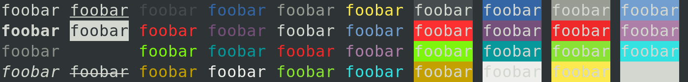

# kolorist

Tiny library to put colors into stdin/stdout :tada:



## Usage

```bash
npm install --save-dev kolorist
```

```js
import { red, cyan } from 'kolorist';

console.log(red(`Error: something failed in ${cyan('my-file.js')}.`));
```

You can also disable or enable colors globally via the following environment variables:

- disable:
  - `NODE_DISABLE_COLORS`
  - `TERM=dumb`
  - `FORCE_COLOR=0`

- enable:
  - `FORCE_COLOR=1`

On top of that you can disable colors right from node:

```js
import { options, red } from 'kolorist';

options.enabled = false;
console.log(red('foo'));
// Logs a string without colors
```

You can also strip colors from a string:

```js
import { red, stripColors } from 'kolorist';

console.log(stripColors(red('foo')));
// Logs 'foo'
```

### License

`MIT`, see [the license file](./LICENSE).
